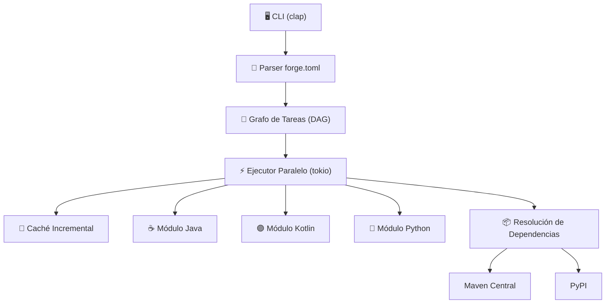

# 🔥 FORGE — Build System de Nueva Generación

Un sucesor moderno de Gradle, escrito en **Rust**, diseñado para ser rápido, simple y extensible. Soporta **Java**, **Kotlin** y **Python** de forma nativa.

## ¿Por qué "FORGE"?

Una **fragua** (forge) es donde se forjan herramientas. Este build system forja tus proyectos con velocidad y precisión.

## Revisión del Usuario

> [!IMPORTANT]
> **Lenguaje del proyecto**: Todo el código estará escrito en **Rust**. Necesitarás tener instalado [Rust/Cargo](https://rustup.rs/) para compilar FORGE.

> [!IMPORTANT]
> **Nombre sugerido**: He propuesto **"FORGE"** como nombre. Si prefieres otro nombre, dímelo antes de empezar.

> [!WARNING]
> **Alcance MVP**: Este plan cubre una "semilla con brote" — lo suficiente para que funcione y atraiga contribuidores. No incluye todas las funcionalidades de Gradle (eso vendrá con la comunidad).

## Arquitectura General



## Ventajas sobre Gradle

| Problema de Gradle | Solución en FORGE |
|---|---|
| Arranque lento (JVM) | Binario nativo Rust — arranque instantáneo |
| Alto consumo de memoria | Rust usa mínima memoria sin GC |
| Configuración compleja (Groovy/Kotlin DSL) | TOML simple y legible |
| Difícil de depurar | Mensajes de error claros con contexto |
| Curva de aprendizaje alta | Convención sobre configuración |
| Solo JVM nativo | Java + Kotlin + Python desde el inicio |

## Cambios Propuestos

### Estructura del Proyecto (Cargo Workspace)

```
E:\CYRCE\
├── Cargo.toml              ← Workspace raíz
├── README.md               ← Documentación para GitHub
├── LICENSE                  ← Licencia MIT
│
├── crates/
│   ├── forge-cli/          ← Binario principal (CLI)
│   │   ├── Cargo.toml
│   │   └── src/
│   │       └── main.rs
│   │
│   ├── forge-core/         ← Motor: DAG, ejecutor, caché
│   │   ├── Cargo.toml
│   │   └── src/
│   │       ├── lib.rs
│   │       ├── config.rs       ← Parser de forge.toml
│   │       ├── dag.rs          ← Grafo de tareas
│   │       ├── executor.rs     ← Ejecutor paralelo
│   │       ├── cache.rs        ← Caché incremental
│   │       └── error.rs        ← Tipos de error
│   │
│   ├── forge-langs/        ← Módulos de lenguaje
│   │   ├── Cargo.toml
│   │   └── src/
│   │       ├── lib.rs
│   │       ├── java.rs         ← Compilación Java (javac, jar)
│   │       ├── kotlin.rs       ← Compilación Kotlin (kotlinc)
│   │       └── python.rs       ← Gestión Python (venv, pip)
│   │
│   └── forge-deps/         ← Resolución de dependencias
│       ├── Cargo.toml
│       └── src/
│           ├── lib.rs
│           ├── maven.rs        ← Descarga de Maven Central
│           └── pypi.rs         ← Descarga de PyPI
│
└── tests/                  ← Tests de integración
    ├── java_project/       ← Proyecto Java de prueba
    ├── kotlin_project/     ← Proyecto Kotlin de prueba
    └── python_project/     ← Proyecto Python de prueba
```

---

### Crate `forge-cli` — Interfaz de Línea de Comandos

#### [NEW] [main.rs](file:///E:/CYRCE/crates/forge-cli/src/main.rs)

El punto de entrada. Usa `clap` para parsear comandos:

- `forge init` — Crear un nuevo `forge.toml` en el directorio actual
- `forge build` — Compilar el proyecto
- `forge run` — Compilar y ejecutar
- `forge test` — Ejecutar tests
- `forge clean` — Limpiar artefactos
- `forge deps` — Mostrar árbol de dependencias

Muestra salida con colores (`colored`) y barras de progreso (`indicatif`).

---

### Crate `forge-core` — Motor Principal

#### [NEW] [config.rs](file:///E:/CYRCE/crates/forge-core/src/config.rs)

Parser del archivo `forge.toml`. Ejemplo de archivo de configuración:

```toml
[project]
name = "mi-app"
version = "1.0.0"
lang = "java"  # java | kotlin | python

[java]
source = "src/main/java"
target = "17"
main-class = "com.ejemplo.Main"

[dependencies]
"com.google.guava:guava" = "33.0.0"
"org.slf4j:slf4j-api" = "2.0.9"

[tasks.custom]
command = "echo Tarea personalizada"
depends-on = ["build"]
```

#### [NEW] [dag.rs](file:///E:/CYRCE/crates/forge-core/src/dag.rs)

Grafo Acíclico Dirigido (DAG) para ordenar y paralelizar tareas:
- Detección de ciclos
- Ordenamiento topológico
- Identificación de tareas independientes para ejecución paralela

#### [NEW] [executor.rs](file:///E:/CYRCE/crates/forge-core/src/executor.rs)

Ejecutor asíncrono basado en `tokio`:
- Ejecuta tareas en paralelo cuando no hay dependencias entre ellas
- Maneja errores y cancela tareas dependientes si una falla
- Reporta progreso en tiempo real

#### [NEW] [cache.rs](file:///E:/CYRCE/crates/forge-core/src/cache.rs)

Sistema de caché incremental:
- Calcula hashes SHA-256 de archivos fuente
- Almacena hashes en `.forge/cache.json`
- Salta tareas cuyos inputs no han cambiado
- Comando `forge clean` limpia la caché

---

### Crate `forge-langs` — Módulos de Lenguaje

#### [NEW] [java.rs](file:///E:/CYRCE/crates/forge-langs/src/java.rs)

- Detecta archivos `.java` en el directorio fuente
- Invoca `javac` con classpath de dependencias
- Empaqueta en JAR con manifiesto
- Ejecuta con `java -jar`

#### [NEW] [kotlin.rs](file:///E:/CYRCE/crates/forge-langs/src/kotlin.rs)

- Detecta archivos `.kt` en el directorio fuente
- Invoca `kotlinc` con classpath
- Empaqueta en JAR
- Ejecuta con `java -jar` (usa runtime de Kotlin)

#### [NEW] [python.rs](file:///E:/CYRCE/crates/forge-langs/src/python.rs)

- Crea/detecta entorno virtual (`venv`)
- Instala dependencias con `pip`
- Ejecuta scripts Python
- Gestiona `requirements.txt` automáticamente

---

### Crate `forge-deps` — Resolución de Dependencias

#### [NEW] [maven.rs](file:///E:/CYRCE/crates/forge-deps/src/maven.rs)

- Descarga JARs desde Maven Central via HTTPS
- Resuelve dependencias transitivas leyendo POMs
- Cachea JARs en `~/.forge/repository/`

#### [NEW] [pypi.rs](file:///E:/CYRCE/crates/forge-deps/src/pypi.rs)

- Consulta la API JSON de PyPI
- Descarga wheels/sdists
- Instala via pip en el venv del proyecto

---

### Documentación para GitHub

#### [NEW] [README.md](file:///E:/CYRCE/README.md)

README completo con:
- Logo/banner
- Descripción del proyecto
- Instalación
- Inicio rápido
- Comparación con Gradle
- Guía de contribución
- Roadmap

#### [NEW] [LICENSE](file:///E:/CYRCE/LICENSE)

Licencia MIT para máxima adopción open-source.

---

## Plan de Verificación

### Tests Automatizados

Se crearán tests unitarios dentro de cada crate y tests de integración:

```bash
# Ejecutar todos los tests
cargo test --workspace

# Tests de un crate específico
cargo test -p forge-core
cargo test -p forge-langs
cargo test -p forge-deps
```

**Tests unitarios clave:**
- `dag.rs` — Verificar ordenamiento topológico, detección de ciclos
- `config.rs` — Parsear distintos `forge.toml` válidos e inválidos
- `cache.rs` — Verificar detección de cambios por hash
- `executor.rs` — Verificar ejecución paralela y manejo de errores

### Tests de Integración

Se crearán 3 proyectos de ejemplo mínimos en `tests/`:

1. **Proyecto Java**: Un `Main.java` con `System.out.println("Hello from FORGE!")` → `forge build` debe compilar → `forge run` debe imprimir el mensaje
2. **Proyecto Kotlin**: Un `Main.kt` equivalente → misma verificación
3. **Proyecto Python**: Un `main.py` con `print("Hello from FORGE!")` → `forge run` debe ejecutar correctamente

```bash
# Compilar FORGE y probar con proyecto Java
cargo run -- build --project-dir tests/java_project
cargo run -- run --project-dir tests/java_project
# Debe imprimir: "Hello from FORGE!"
```

### Verificación Manual

> [!NOTE]
> Se le pedirá al usuario que ejecute los siguientes pasos para verificar que FORGE funciona correctamente en su máquina:

1. **Compilar FORGE**: `cargo build --release` en `E:\CYRCE`
2. **Inicializar un proyecto**: `forge init` en un directorio vacío y verificar que se crea `forge.toml`
3. **Compilar proyecto Java de prueba**: `forge build` y verificar que se genera el `.class`/`.jar`
4. **Ejecutar proyecto**: `forge run` y verificar la salida esperada
